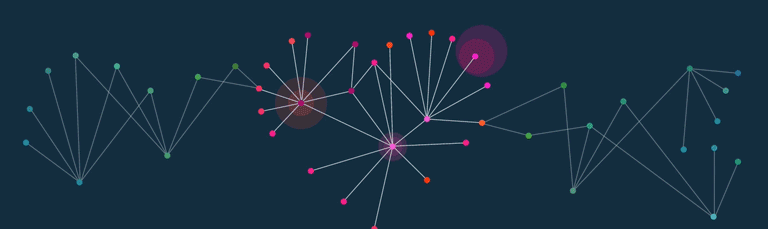
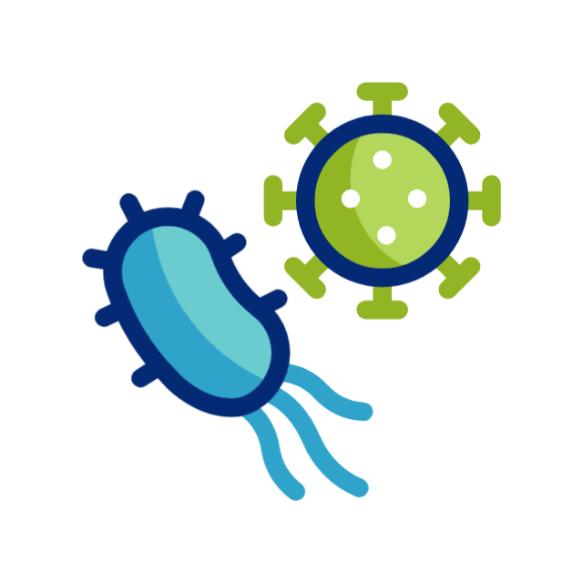

<!-- ====== HEADER BANNER ====== -->

  <!-- soft wave banner -->
  

  

  <b>PhD Researcher · Plant–Microbiota · AI/ML for Biology</b> 
  <i>Decoding how microbial communities shape plant immunity using multi-omics and machine learning.</i>

  <!-- quick links -->
  
  
  
  
  

---

### 🔬 About me
- 📚 PhD candidate exploring **PRR–ligand interactions**, **peptidomics**, and **transcriptomics**  
- 🤖 Building **predictive models** (RF/XGBoost/DL) linking SynCom composition → plant traits  
- 🧰 I care about **reproducible research**: open datasets, clean pipelines, and clear docs

---

### 🧠 AI/ML & Scientific Computing

  <!-- AI frameworks -->
  
  
  
  
  
  
  
  
  
  

  <!-- languages / tooling -->
  
  
  
  
  
  
  

---

### 🧪 Wet-lab & Omics

  
  
  
  

---

### 📌 Featured work
- **Combinatorial gRNA Designer** — CHOPCHOP-powered local webapp for *A. thaliana*  
  `Python · Flask/Gunicorn · Live logs · PDF report`  
  ➜ https://github.com/combinatorial-grna-design

- **Microbiota ↔ Transcriptome ML** — Predict plant traits from SynComs + RNA-seq  
  `PyTorch · sklearn · SHAP · Bayesian optimization`  
  ➜ https://github.com/microbiota-ml-pipeline

- **RNA-seq Toolkit** — kallisto → DESeq2 → clustering → GO enrichment  
  `Snakemake · R · tidyverse · ggplot2`  
  ➜ https://github.com/rnaseq-toolkit

---

### 📝 Selected publications
- (2025) *Misregulation of the jasmonate signaling pathway leads to altered plant microbiota interaction and plant stress responses* — bioRxiv  
- (2021) *Forecasting anthracnose-twister disease using weather based parameters: geographically weighted regression focus* - Spatial Information Research
- Full list on **[Google Scholar](https://scholar.google.com/citations?user=EfU1b5UAAAAJ&hl=en)**

---

### 📊 Research & Dev metrics

  <!-- GitHub profile stats -->
  
  

Recent activity & time tracking (optional)

- Add **WakaTime** or **GitHub Activity** widgets if you use them.  
- Example (replace with your usernames/tokens):
  
  ``

---

### 📦 Datasets & Reproducibility
- Data archived on **Zenodo** with DOIs; see each repo’s `CITATION.cff`  
- Environments pinned via `environment.yml` / `requirements.txt`  
- Docker images published via GitHub Packages

---

### 🎓 Teaching & resources
- Short tutorials: **kallisto/DESeq2**, **GO enrichment**, **SHAP interpretations**  
- Slides & notebooks: https://github.com/teaching

---

  

